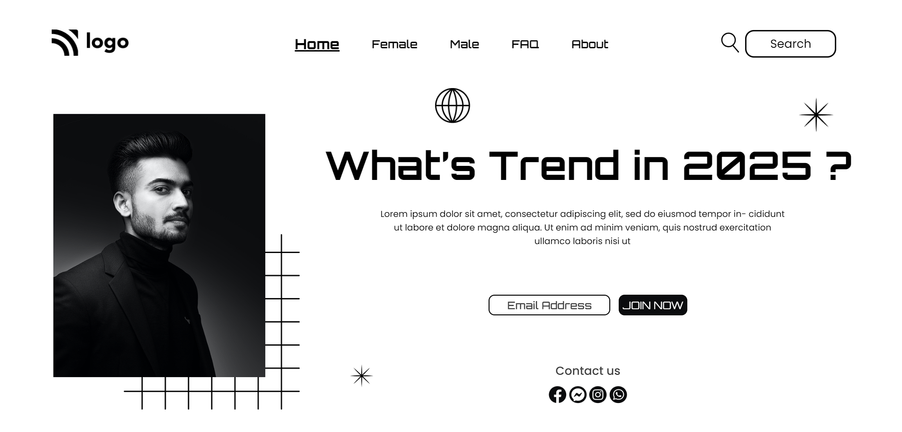

# Portfolio Web Page

by Mansi

## Tech Stack:

### _Live Hosted Link 🚀_ : _[Portfolio Web Page](https://trend-in-2025.netlify.app/)_

## How the website looks like:

## My Learnings:

-   Skills Gained in this project
    -   Learnd to use css position [Relative & Absolute] property.
    -   Learned to use pseudo classes like **:nth-child()**.
    -   Learned to use z indexing to stack elements on top of each other.

